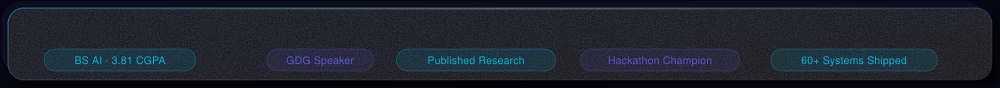

<!-- ══════════════════════════════════════════════════════════ -->
<!--  AHMAD YASIN · NEXARIZA AI                               -->
<!--  Neomorphism · Glassmorphism · Skeuomorphism · Water      -->
<!--  Install: push assets/ folder + this README.md           -->
<!-- ══════════════════════════════════════════════════════════ -->

<!-- ┌─ HERO BANNER ────────────────────────────────────────────┐ -->

<!-- └──────────────────────────────────────────────────────────┘ -->

 

<!-- ┌─ STATUS ─────────────────────────────────────────────────┐ -->

&nbsp;·&nbsp;

&nbsp;·&nbsp;

<!-- └──────────────────────────────────────────────────────────┘ -->

 

<!-- ┌─ PROFILE ────────────────────────────────────────────────┐ -->

## Ahmad Yasin

**Founder & CEO — [Nexariza AI](https://nexariza.com)**&emsp;AI Engineer · AI Systems Architect

I build production AI systems that create measurable business outcomes — from model architecture and inference pipeline to deployed, scaled product.

 

 

 

<!-- ┌─ DIVIDER ────────────────────────────────────────────────┐ -->

<!-- └──────────────────────────────────────────────────────────┘ -->

 

<!-- ┌─ NEXARIZA AI ────────────────────────────────────────────┐ -->

**Nexariza AI** — AI engineering company building intelligent systems, AI employees, and automation 
platforms for organizations across **North America · Europe · GCC · Asia-Pacific**.

🌐 [nexariza.com](https://nexariza.com)&emsp;·&emsp;📩 [contact@nexariza.com](mailto:contact@nexariza.com)&emsp;·&emsp;💬 [+92 370 7348001](https://wa.me/923707348001)

 

 

<!-- └──────────────────────────────────────────────────────────┘ -->

 

<!-- ┌─ EXPERTISE ──────────────────────────────────────────────┐ -->

 

<!-- └──────────────────────────────────────────────────────────┘ -->

 

<!-- ┌─ TECHNOLOGY ─────────────────────────────────────────────┐ -->

**AI · ML · Vision**

**Full-Stack · Infrastructure**

`LangChain` &nbsp;·&nbsp; `LangGraph` &nbsp;·&nbsp; `OpenAI` &nbsp;·&nbsp; `Claude` &nbsp;·&nbsp; `Gemini` &nbsp;·&nbsp; `Hugging Face` &nbsp;·&nbsp; `Qdrant`  
`YOLOv8` &nbsp;·&nbsp; `ByteTrack` &nbsp;·&nbsp; `ONNX Runtime` &nbsp;·&nbsp; `Whisper` &nbsp;·&nbsp; `AdaFace` &nbsp;·&nbsp; `SCRFD` &nbsp;·&nbsp; `VAPI`

 

<!-- └──────────────────────────────────────────────────────────┘ -->

 

<!-- ┌─ SELECTED WORK ──────────────────────────────────────────┐ -->

 

<!-- └──────────────────────────────────────────────────────────┘ -->

 

<!-- ┌─ GITHUB ─────────────────────────────────────────────────┐ -->

 

  

 

 

<!-- └──────────────────────────────────────────────────────────┘ -->

 

<!-- ┌─ CTA ────────────────────────────────────────────────────┐ -->

*Building something that needs AI intelligence at its core?*

 

&nbsp;&nbsp;&nbsp;

 

<!-- └──────────────────────────────────────────────────────────┘ -->

<!-- ┌─ DIRECTORY (hidden) ─────────────────────────────────────┐ -->

All Profiles & Links

 

| | Ahmad Yasin | | Nexariza AI |
|:---:|:---|:---:|:---|
| 🌐 | [ahmadyasin.vercel.app](https://ahmadyasin.vercel.app) | 🌐 | [nexariza.com](https://nexariza.com) |
| 💼 | [linkedin.com/in/ahmadyasin1](https://www.linkedin.com/in/ahmadyasin1) | 💼 | [Nexariza on LinkedIn](https://www.linkedin.com/company/nexariza) |
| 💻 | [github.com/Ahmadyasin1](https://github.com/Ahmadyasin1) | 📸 | [@nexariza_ai](https://www.instagram.com/nexariza_ai/) |
| 🤗 | [huggingface.co/AhmadYasin](https://huggingface.co/AhmadYasin) | 📘 | [Nexariza on Facebook](https://www.facebook.com/nexariza/) |
| 🧪 | [kaggle.com/ahmadyasin1](https://www.kaggle.com/ahmadyasin1) | 🎯 | [Nexariza on Fiverr](https://www.fiverr.com/s/dDmlq9G) |
| 🟢 | [g.dev/ahmad-yasin](https://g.dev/ahmad-yasin) | 💼 | [Ahmad on Upwork](https://www.upwork.com/freelancers/~013900a3c3552a40a6) |
| ✍️ | [medium.com/@mianahmadyasin](https://medium.com/@mianahmadyasin) | 🚀 | [Nexariza on Contra](https://contra.com/company/nexariza_ai_762ab8) |
| 📸 | [@mianahmadyasin](https://instagram.com/mianahmadyasin) | ▶️ | [Nexariza Learning Hub](https://www.youtube.com/@NexarizaLearningHub) |
| 📩 | [contact@nexariza.com](mailto:contact@nexariza.com) | 💬 | [WhatsApp](https://wa.me/923707348001) |

<!-- └──────────────────────────────────────────────────────────┘ -->

 

<!-- ┌─ FOOTER ─────────────────────────────────────────────────┐ -->

AI Engineering &nbsp;·&nbsp; Intelligent Automation &nbsp;·&nbsp; Computer Vision &nbsp;·&nbsp; Generative AI &nbsp;·&nbsp; Full-Stack AI
  

<!-- └──────────────────────────────────────────────────────────┘ -->
