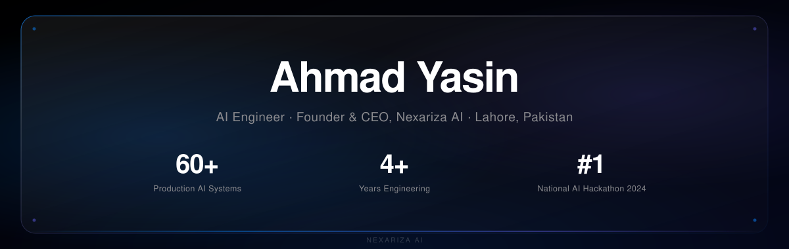
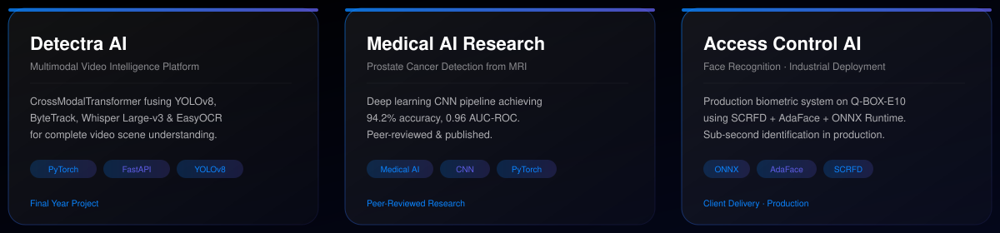

<!-- ══════════════════════════════════════════════════════════ -->
<!--   AHMAD YASIN · FOUNDER & CEO · NEXARIZA AI              -->
<!--   AI Engineer · AI Systems Architect · Technical Founder  -->
<!--   nexariza.com · contact@nexariza.com                     -->
<!-- ══════════════════════════════════════════════════════════ -->

<!-- ┌─ GLASS BANNER ─────────────────────────────────────────┐ -->

<!-- └────────────────────────────────────────────────────────┘ -->

 

<!-- ┌─ STATUS ROW ────────────────────────────────────────────┐ -->

&nbsp;

&nbsp;

<!-- └────────────────────────────────────────────────────────┘ -->

 

<!-- ┌─ PROFILE ───────────────────────────────────────────────┐ -->

## Ahmad Yasin

**Founder & CEO — [Nexariza AI](https://nexariza.com)** &nbsp;·&nbsp; AI Engineer &nbsp;·&nbsp; AI Systems Architect  
Lahore, Pakistan &nbsp;→&nbsp; US · EU · UAE · MENA

I build production-ready AI systems that deliver measurable business outcomes for organizations worldwide — not demos, not notebooks, real deployed software.

 

`🎓 BS AI · 3.81 CGPA · UCP 2026` &nbsp;&nbsp; `🏆 National AI Hackathon Champion 2024` &nbsp;&nbsp; `🔬 Peer-Reviewed Publication` &nbsp;&nbsp; `🎤 GDG Speaker`

 

 

<!-- ┌─ DIVIDER ───────────────────────────────────────────────┐ -->

<!-- └────────────────────────────────────────────────────────┘ -->

 

<!-- ┌─ NEXARIZA AI ───────────────────────────────────────────┐ -->

### &nbsp;Nexariza AI

&nbsp;AI engineering company designing intelligent systems, AI employees, and automation platforms for 
&nbsp;organizations across **North America · Europe · GCC · Asia-Pacific**.

 

🌐 [nexariza.com](https://nexariza.com) &nbsp;·&nbsp; 📩 [contact@nexariza.com](mailto:contact@nexariza.com) &nbsp;·&nbsp; 💬 [+92 370 7348001](https://wa.me/923707348001) &nbsp;·&nbsp; 💼 [LinkedIn](https://www.linkedin.com/company/nexariza) &nbsp;·&nbsp; 📸 [Instagram](https://www.instagram.com/nexariza_ai/)

 

 

<!-- └────────────────────────────────────────────────────────┘ -->

<!-- ┌─ EXPERTISE CARDS ───────────────────────────────────────┐ -->

### Areas of Expertise

 

 
<!-- └────────────────────────────────────────────────────────┘ -->

<!-- ┌─ TECH STACK ────────────────────────────────────────────┐ -->

### Technology Stack

**AI · ML · Vision**

**Full-Stack · Infrastructure**

**Tools · Platforms**

 

`LangChain` &nbsp;·&nbsp; `LangGraph` &nbsp;·&nbsp; `OpenAI` &nbsp;·&nbsp; `Anthropic Claude` &nbsp;·&nbsp; `Gemini` &nbsp;·&nbsp; `Hugging Face` &nbsp;·&nbsp; `Qdrant`  
`YOLOv8` &nbsp;·&nbsp; `ByteTrack` &nbsp;·&nbsp; `ONNX Runtime` &nbsp;·&nbsp; `SCRFD` &nbsp;·&nbsp; `AdaFace` &nbsp;·&nbsp; `Whisper` &nbsp;·&nbsp; `EasyOCR` &nbsp;·&nbsp; `VAPI`

 

 
<!-- └────────────────────────────────────────────────────────┘ -->

<!-- ┌─ SELECTED WORK ─────────────────────────────────────────┐ -->

### Selected Work

 

 
<!-- └────────────────────────────────────────────────────────┘ -->

<!-- ┌─ GITHUB METRICS ────────────────────────────────────────┐ -->

### GitHub

 

  

 

 

 
<!-- └────────────────────────────────────────────────────────┘ -->

<!-- ┌─ CONTACT CTA ───────────────────────────────────────────┐ -->

### Start a Conversation

*Whether you're building an AI product, automating operations, or need a trusted long-term AI engineering partner — let's talk.*

 

&nbsp;&nbsp;

 

| Platform | Link |
|:---:|:---:|
| 💼 Upwork | [Ahmad Yasin on Upwork](https://www.upwork.com/freelancers/~013900a3c3552a40a6) |
| 🎯 Fiverr | [Nexariza AI on Fiverr](https://www.fiverr.com/s/dDmlq9G) |
| 🚀 Contra | [Nexariza AI on Contra](https://contra.com/company/nexariza_ai_762ab8) |

 

<!-- └────────────────────────────────────────────────────────┘ -->

<!-- ┌─ FULL DIRECTORY ────────────────────────────────────────┐ -->

All Profiles & Links

 

| | Ahmad Yasin | | Nexariza AI |
|:---:|:---|:---:|:---|
| 🌐 | [ahmadyasin.vercel.app](https://ahmadyasin.vercel.app) | 🌐 | [nexariza.com](https://nexariza.com) |
| 💼 | [linkedin.com/in/ahmadyasin1](https://www.linkedin.com/in/ahmadyasin1) | 💼 | [Nexariza on LinkedIn](https://www.linkedin.com/company/nexariza) |
| 💻 | [github.com/Ahmadyasin1](https://github.com/Ahmadyasin1) | 📸 | [@nexariza_ai](https://www.instagram.com/nexariza_ai/) |
| 🤗 | [huggingface.co/AhmadYasin](https://huggingface.co/AhmadYasin) | 📘 | [Nexariza on Facebook](https://www.facebook.com/nexariza/) |
| 🧪 | [kaggle.com/ahmadyasin1](https://www.kaggle.com/ahmadyasin1) | 🎯 | [Nexariza on Fiverr](https://www.fiverr.com/s/dDmlq9G) |
| 🟢 | [g.dev/ahmad-yasin](https://g.dev/ahmad-yasin) | 💼 | [Ahmad on Upwork](https://www.upwork.com/freelancers/~013900a3c3552a40a6) |
| ✍️ | [medium.com/@mianahmadyasin](https://medium.com/@mianahmadyasin) | 🚀 | [Nexariza on Contra](https://contra.com/company/nexariza_ai_762ab8) |
| 📸 | [@mianahmadyasin](https://instagram.com/mianahmadyasin) | ▶️ | [Nexariza Learning Hub](https://www.youtube.com/@NexarizaLearningHub) |
| 📩 | [contact@nexariza.com](mailto:contact@nexariza.com) | 💬 | [+92 370 7348001](https://wa.me/923707348001) |

<!-- └────────────────────────────────────────────────────────┘ -->

 

<!-- ┌─ FOOTER ────────────────────────────────────────────────┐ -->

AI Engineering &nbsp;·&nbsp; Intelligent Automation &nbsp;·&nbsp; Computer Vision &nbsp;·&nbsp; Generative AI &nbsp;·&nbsp; Full-Stack AI Products

 

<!-- └────────────────────────────────────────────────────────┘ -->
