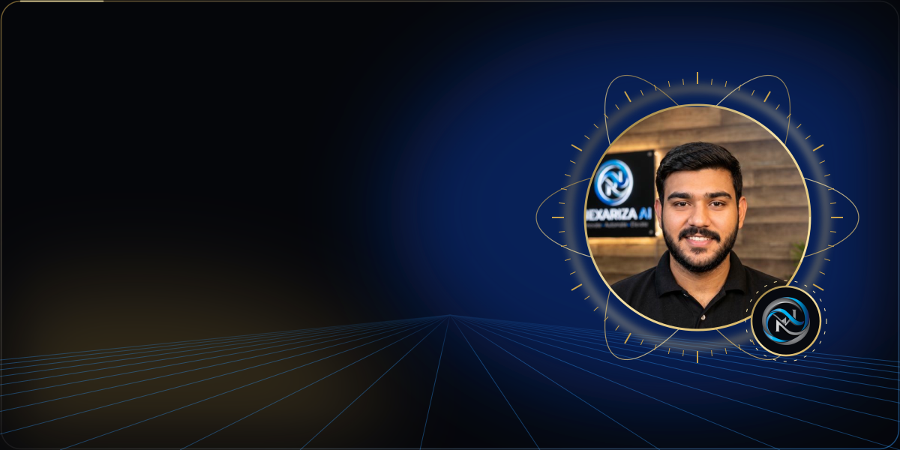
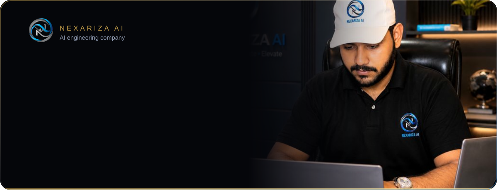
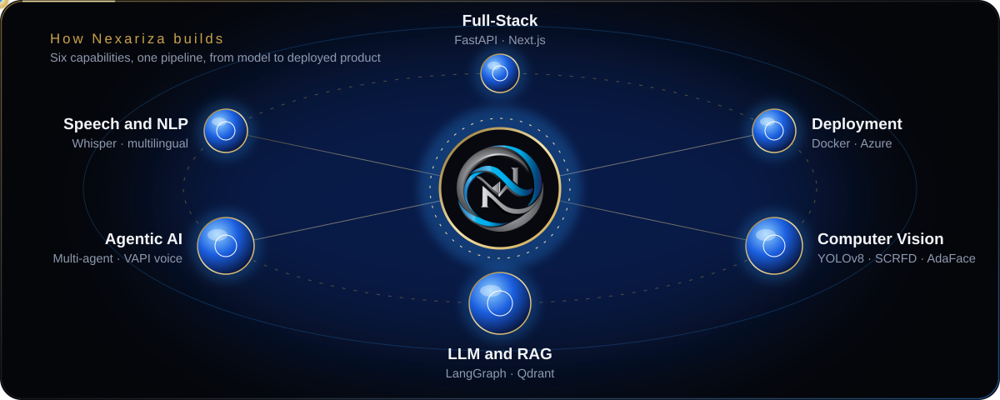
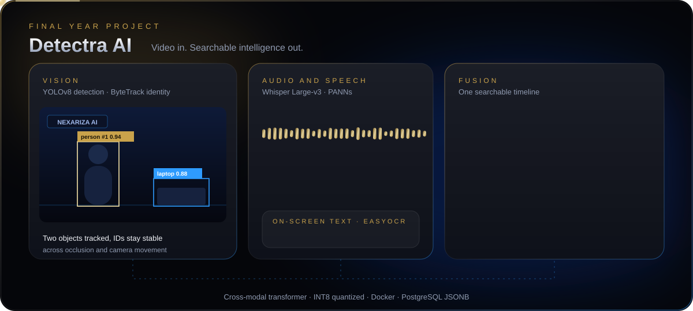
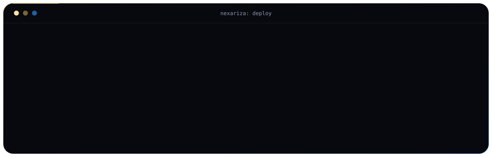

<h1>Ahmad Yasin · AI Engineer and Founder of Nexariza AI</h1>

<b>AI systems architect building production LLM, RAG, agentic AI and computer vision systems for organizations across North America, Europe, the GCC and Asia-Pacific.</b>

 

🌐 <a href="https://nexariza.com">nexariza.com</a> &emsp;·&emsp; 📩 <a href="mailto:contact@nexariza.com">contact@nexariza.com</a> &emsp;·&emsp; 💬 <a href="https://wa.me/923707348001">+92 370 7348001</a>

## About Ahmad Yasin

**Ahmad Yasin** (GitHub: [@Ahmadyasin1](https://github.com/Ahmadyasin1)) is an AI engineer and AI systems architect, and the Founder & CEO of [Nexariza AI](https://nexariza.com), an AI engineering company that builds intelligent systems, AI employees and automation platforms. He designs and ships production AI end to end: from model architecture and inference pipelines to deployed, monitored products.

**Core expertise:** computer vision (YOLOv8, ByteTrack, SCRFD, AdaFace, ONNX Runtime) · LLM and RAG systems (LangChain, LangGraph, Qdrant, Hugging Face) · agentic AI and voice agents (VAPI) · speech and NLP (Whisper) · full-stack deployment (FastAPI, Next.js, PostgreSQL, Docker, Azure).

**Recognition:** 1st place, National AI Hackathon 2024 (Computer Vision track) · BS Artificial Intelligence, University of Central Punjab (3.81/4.00) · peer-reviewed medical AI publication · speaker at Google Developer Groups · 60+ production AI systems delivered to international clients.

**Selected work:** Detectra AI (multimodal video intelligence), Nexariza Cortex (agentic business operating system blueprint), NexarizaFlow (self-hosted browser-extension platform).

&nbsp;

## Frequently asked questions

<b>Who is Ahmad Yasin?</b>

 Ahmad Yasin is an AI engineer, AI systems architect and the Founder & CEO of Nexariza AI. He builds production AI systems in computer vision, large language models, retrieval-augmented generation (RAG) and agentic automation. Profiles: <a href="https://ahmadyasin.vercel.app">portfolio</a>, <a href="https://www.linkedin.com/in/ahmadyasin1">LinkedIn</a>, <a href="https://huggingface.co/AhmadYasin">Hugging Face</a>, <a href="https://www.kaggle.com/ahmadyasin1">Kaggle</a>.

<b>What does Nexariza AI do?</b>

 Nexariza AI is an AI engineering company founded by Ahmad Yasin. It builds intelligent systems, AI employees and automation platforms for organizations in North America, Europe, the GCC and Asia-Pacific. Website: <a href="https://nexariza.com">nexariza.com</a>.

<b>Which AI technologies does Ahmad Yasin work with?</b>

 Python, PyTorch, TensorFlow, OpenCV, YOLOv8, ByteTrack, ONNX Runtime, Whisper, LangChain, LangGraph, Qdrant, Hugging Face, OpenAI, Claude, Gemini, VAPI, FastAPI, Node.js, React, Next.js, PostgreSQL, Redis, Docker and Azure.

<b>What is Detectra AI?</b>

 Detectra AI is a multimodal video intelligence system built by Ahmad Yasin as a final year project. It fuses object tracking (YOLOv8, ByteTrack), speech recognition (Whisper Large-v3), audio events (Librosa, PANNs) and on-screen text (EasyOCR) into one searchable timeline.

<b>How can I hire Ahmad Yasin or Nexariza AI?</b>

 Start a project at <a href="https://nexariza.com/contact">nexariza.com/contact</a>, email <a href="mailto:contact@nexariza.com">contact@nexariza.com</a>, message on <a href="https://wa.me/923707348001">WhatsApp</a>, or hire through <a href="https://www.upwork.com/freelancers/~013900a3c3552a40a6">Upwork</a> or <a href="https://www.fiverr.com/s/dDmlq9G">Fiverr</a>.

All profiles and links

 

| | Ahmad Yasin | | Nexariza AI |
|:---:|:---|:---:|:---|
| 🌐 | [ahmadyasin.vercel.app](https://ahmadyasin.vercel.app) | 🌐 | [nexariza.com](https://nexariza.com) |
| 💼 | [linkedin.com/in/ahmadyasin1](https://www.linkedin.com/in/ahmadyasin1) | 💼 | [Nexariza on LinkedIn](https://www.linkedin.com/company/nexariza) |
| 💻 | [github.com/Ahmadyasin1](https://github.com/Ahmadyasin1) | 📸 | [@nexariza_ai](https://www.instagram.com/nexariza_ai/) |
| 🤗 | [huggingface.co/AhmadYasin](https://huggingface.co/AhmadYasin) | 📘 | [Nexariza on Facebook](https://www.facebook.com/nexariza/) |
| 🧪 | [kaggle.com/ahmadyasin1](https://www.kaggle.com/ahmadyasin1) | 🎯 | [Nexariza on Fiverr](https://www.fiverr.com/s/dDmlq9G) |
| 🟢 | [g.dev/ahmad-yasin](https://g.dev/ahmad-yasin) | 💼 | [Ahmad on Upwork](https://www.upwork.com/freelancers/~013900a3c3552a40a6) |
| ✍️ | [medium.com/@mianahmadyasin](https://medium.com/@mianahmadyasin) | 🚀 | [Nexariza on Contra](https://contra.com/company/nexariza_ai_762ab8) |
| 📸 | [@mianahmadyasin](https://instagram.com/mianahmadyasin) | ▶️ | [Nexariza Learning Hub](https://www.youtube.com/@NexarizaLearningHub) |
| 📩 | [contact@nexariza.com](mailto:contact@nexariza.com) | 💬 | [WhatsApp](https://wa.me/923707348001) |

AI Engineering · Intelligent Automation · Computer Vision · Generative AI · Full-Stack AI

