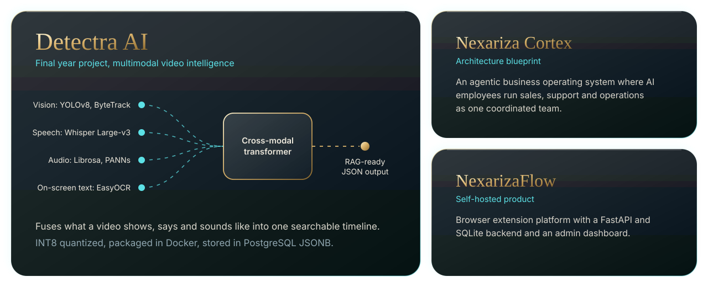

**[Enter the live 3D experience](https://ahmadyasin1.github.io/Ahmadyasin1/)** &nbsp;|&nbsp; WebGL, liquid-glass orb, scroll-driven flight

<table>
<tr>
<td valign="middle">

### The short version

I run **[Nexariza AI](https://nexariza.com)**, an AI engineering company in Lahore that builds production systems for clients in the US, Europe, the UAE and the wider MENA region.

I have been shipping AI for clients since 2022. Across 60+ deployments, the pattern is the same: I own the whole path, from model architecture and inference pipeline to the deployed, monitored product.

I graduated in Artificial Intelligence with a 3.81 CGPA, won the National AI Hackathon 2024 in Computer Vision, and published peer-reviewed research in medical AI.

</td>
<td width="220" valign="middle" align="center">

</td>
</tr>
</table>

 

  

 

Hugging Face: [AhmadYasin](https://huggingface.co/AhmadYasin) &nbsp;|&nbsp; Kaggle: [ahmadyasin1](https://www.kaggle.com/ahmadyasin1) &nbsp;|&nbsp; Medium: [@mianahmadyasin](https://medium.com/@mianahmadyasin) &nbsp;|&nbsp; WhatsApp: [+92 370 7348001](https://wa.me/923707348001)

